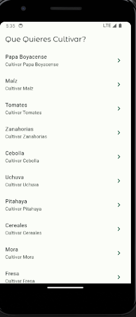
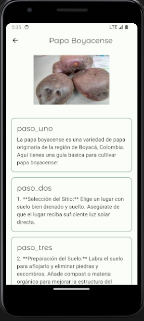

# app_cocechar

La app fue desarrollada con el fin de ampliar mis conocimientos en dart y flutter sobre el manejo de rutas.

Esta es un app que da informacion sobre como cultivar maiz, papa, zanahoria etc...

Esta desarrollada en flutter y dart, la informacion se localiza en 2 archivos

info_json.dart -> Informacion sobre cultivos

detail_json.dart -> Informacion detallada sobre como cultivar algo en especifico

